# add feature: 高度对齐 + 基于字符的背景色

## 背景

在有背景色的场景下，尽管原工程在输出fnt图片时看起来是正常的，但实际上在真正使用的时候，会发现有高度不统一的问题，这主要是由于原工程将背景色当成layout的一个属性，而非字符的。

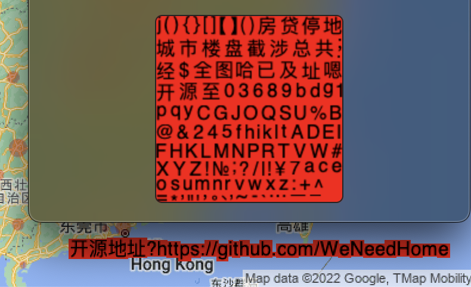  

事实上，在大多数场景下，我们需要以字符为单位设置其背景色，这项特性，其实是基于layout设置背景色的一个超集。尽管这种做法会增大输出的fnt图片文件体积，因为要求每个字符都至少是其目标像素高度，而非像之前一样可以基于`trimXX`属性进行裁切。

具体可以见如下：

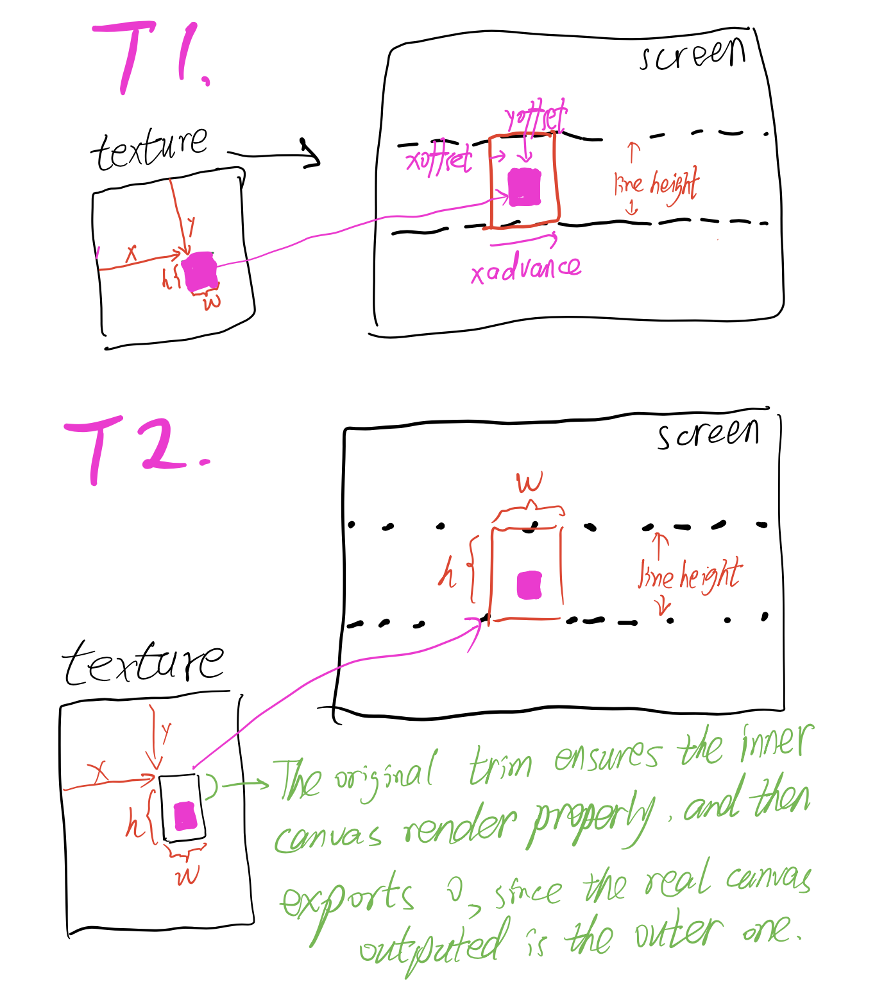  

## 目前实现效果

1. 无背景色 + 无高度对齐 （与原工程效果一致）

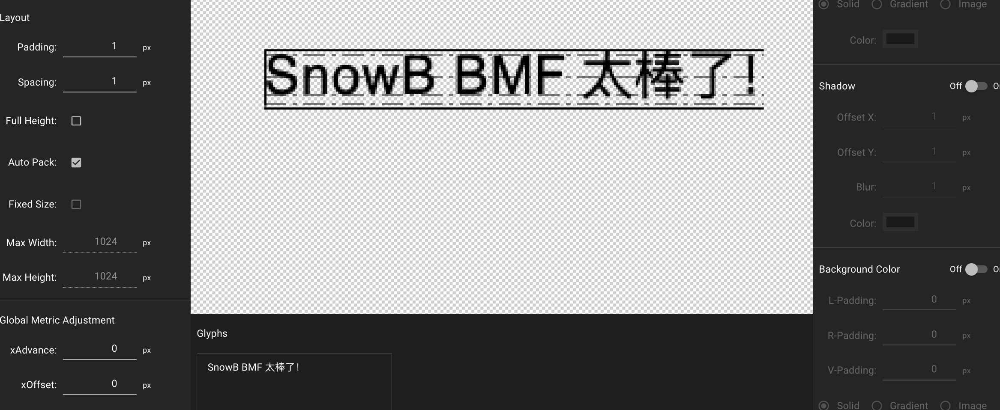

2. 无背景色 + 高度对齐 （与原工程效果一致，但原理不同，字符是以满高输出的）

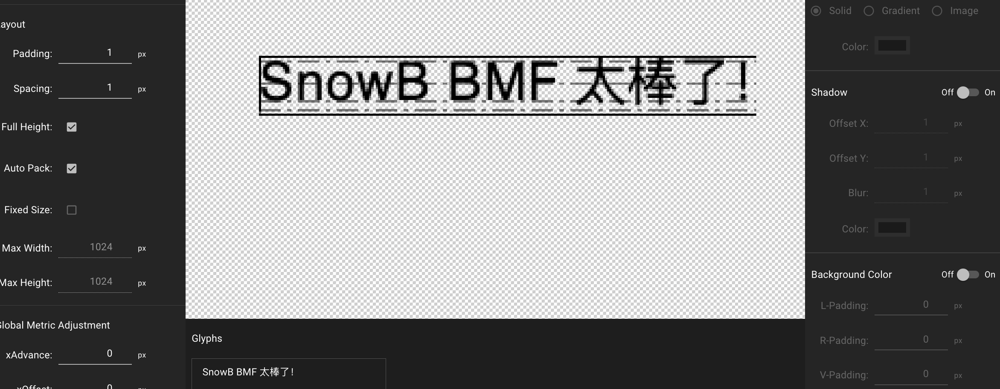  

3. 有背景色 + 无高度对齐 （与原工程效果显著不一样）

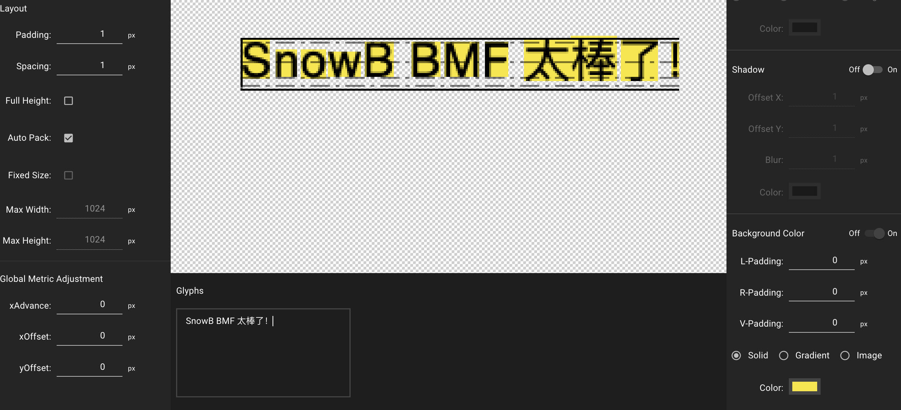  

4. 有背景色 + 高度对齐 （与原工程效果接近，但是字符是以满高输出的，因此在其他程序中的效果将也是等高）

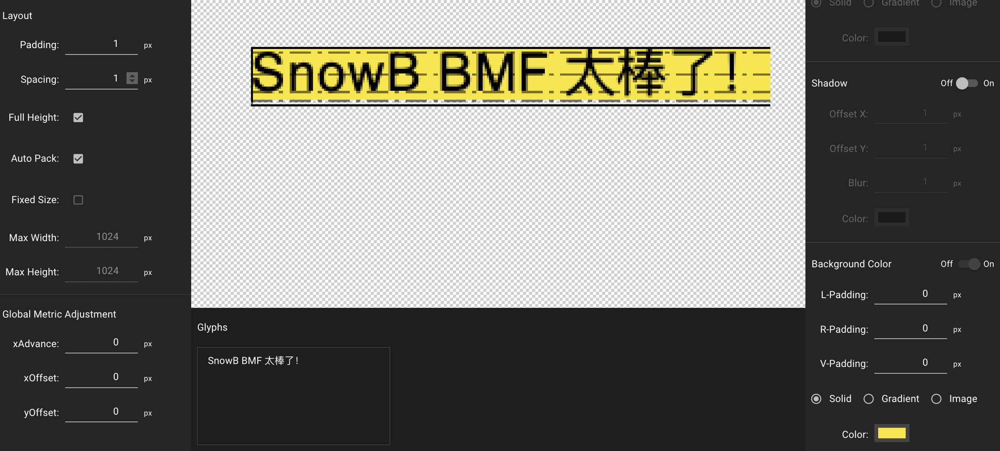  

## 具体变动

1. 取消原 `backgroundColor` layout级别属性，转而在字符中模仿`stroke`与`shadow`，加入了 `bgFill` 属性

2. 按功能整理了 `utils` 文件夹，纠正或优化了一些变量的命名

3. 汇总了几个硬编码的常量到了配置文件中[config.ts](../src/store/config.ts)，例如字体大小、默认测试文字、预览文字等，方便测试开发，后续也方便使用 redux 管理（如果届时可能需要的话）

## 目前问题

### 加载某些自定义字体后 `fontHeight` 与目标像素高度不同

为了方便后续的接口统一，我对 `getGlyphInfo.ts` 和 `getGlyphInfoFromFont.ts` 两个文件进行了一定程序的合并、重组（可能有操作不当的地方）。比如把 `getGlyphInfoFromFont.ts` 文件中初始化 `fontSource` 并且获取 `Path` 的步骤都拆分了出去。

以下是目前两份文件不同之处对比：

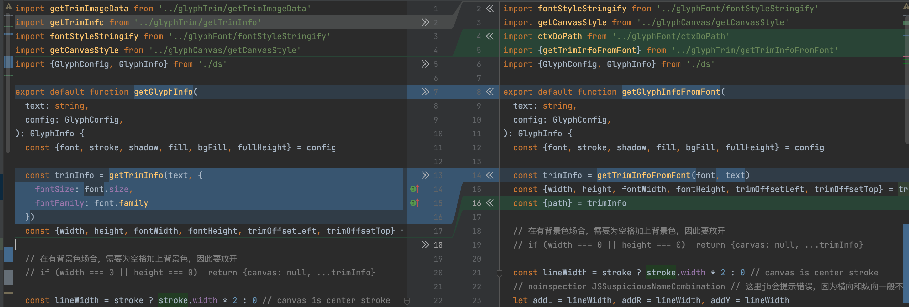  

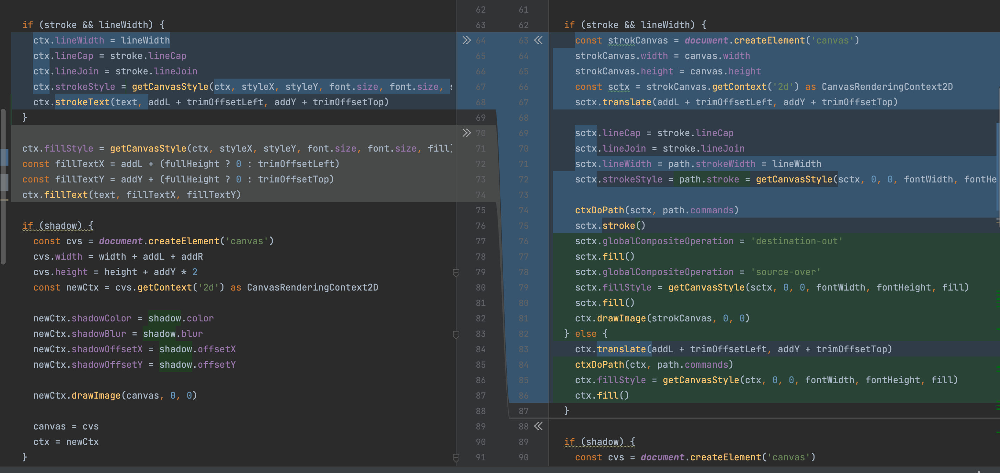  

但现在的问题是，某些自定义字体的 `fontHeight` 的计算结果与目标像素高度不一致：

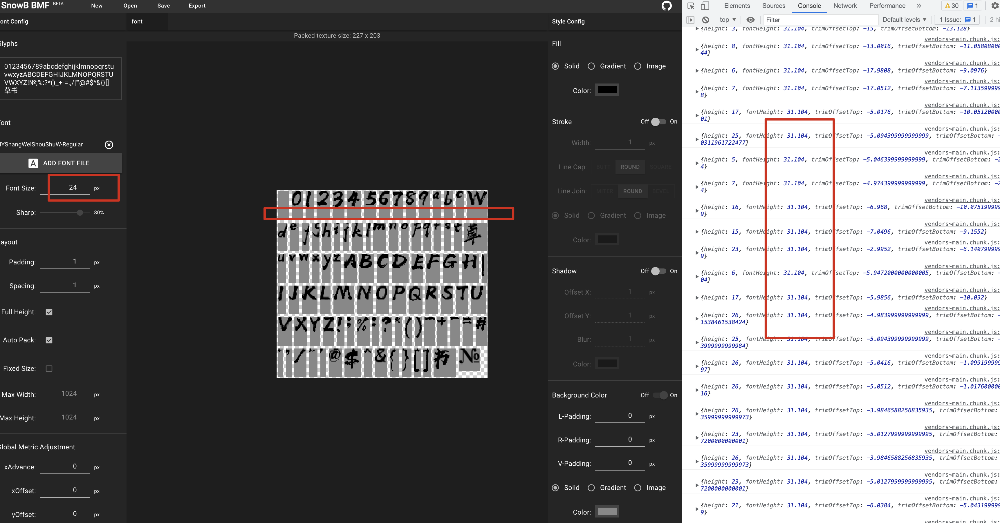  

大多数字体都是符合预期的（目标24），但我测试的那款草书则不行。

该字体位置已存储一份在：[HYShangWeiShouShuW.ttf](./fonts/HYShangWeiShouShuW.ttf)

该目录下还有几份通过测试的字体，也一并呈上，就当做备份了。

## 其他

### 关于 `l/r/vPadding`的设计

这个设计，一开始是为了解决有背景色但是字符中间有缝隙的问题。

但最后实现之后，虽然可以使用，但是不是解决原问题的直接解决方案。

直接解决方案是基于字符的原始宽度与高度强制渲染canvas的宽与高，并且所有的trim都设置成0，这样能够保证最终的输出效果是连在一起的。

比如以下是控制 `l/r/vPadding`的实际效果，可以看到每个字符的左右都实际更宽了一些，并且可能会遮住其他字符。如果遮住，比较好的办法是同时设置 `xAdvance` 全局属性，强行让字去保持更远的距离。

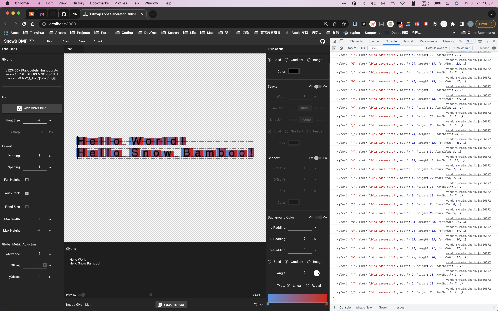  

总之，上述办法在解决程序设计问题导致字符拆开的场景时能有一定的作用，例如设置 lPadding 为 1， rPadding 为 5，基本可以保证字的背景色能连在一起（因为右边的字会覆盖在左边的字上，所以rPadding大一点无所谓，唯一的问题是每一行的最后一个字的右边会有多余的空像素，所以要控制好距离）。

最后在我们将 `fullHeight` 与字符的 `fontHeight | fontWidth` 等绑定好之后，已经不需要人为的去控制左右padding，但vPadding还是有点用，否则背景与行高相同，会让字有点难受。

比如这是 vPadding 为 0 的效果：

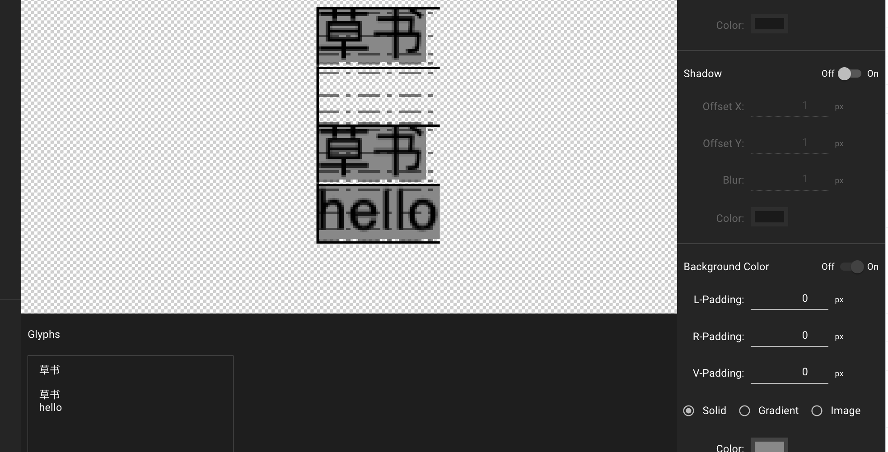  

这是 vPadding 为 3 的效果：

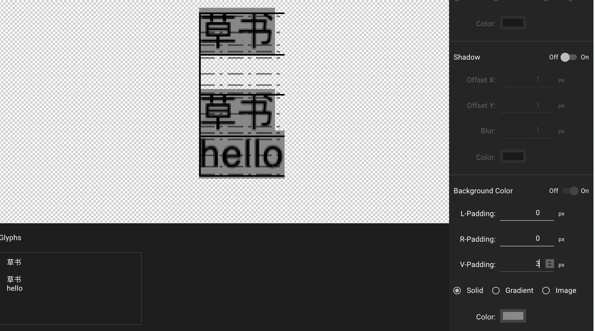  

### FIXED：`font-height` 向下取整，导致高度不对齐

problem:

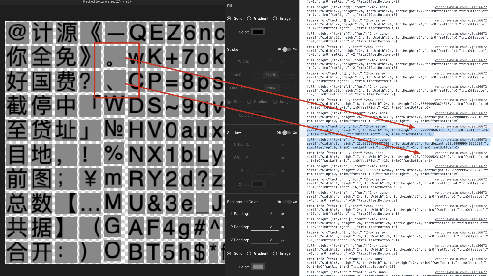  

solution:

这里少了个向上取整的操作（另外，我把函数名改了，以和调用主体对上）

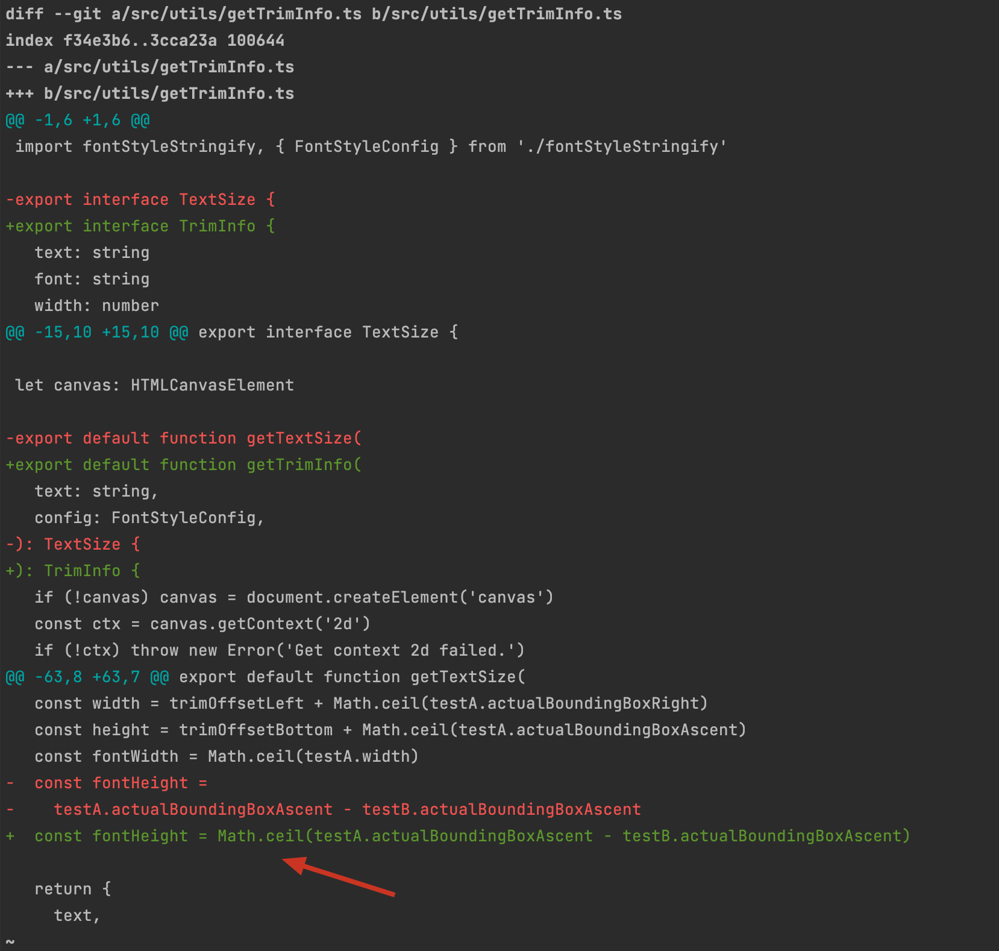  

result:

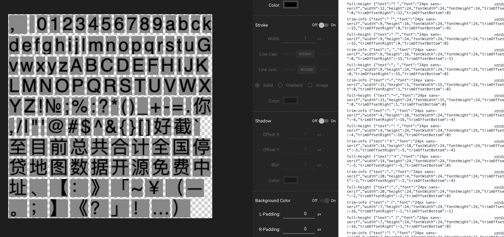  

## 相关参考

### 关于canvas背景着色

- https://stackoverflow.com/a/33178638/9422455
- https://developer.mozilla.org/en-US/docs/Web/API/CanvasRenderingContext2D/fillStyle

## 后记

原工程`src/utils/glyphInfo/getGlyphInfoFromFont.ts` 中也有先生成一个canvas，再粘到另一个上的操作，与我实现单字符背景色的原理是一致的：

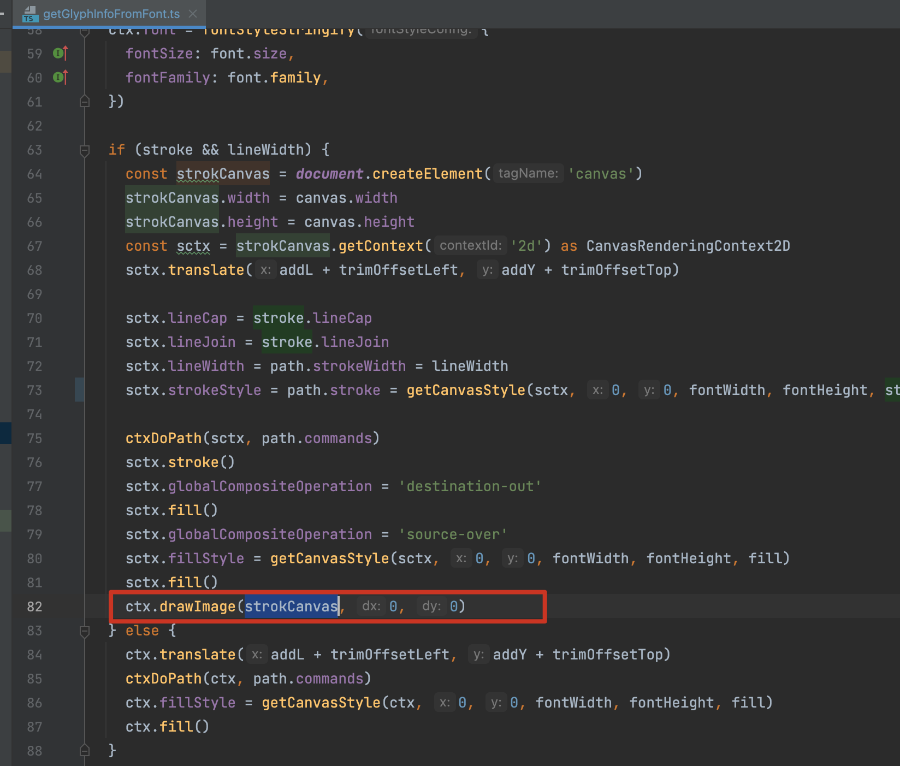  
